# Laporan Proyek Machine Learning - Merri Putri Panggabean

## Project Overview

### Latar Belakang
Dalam era digital saat ini, perkembangan teknologi telah mengubah cara manusia mengakses dan mengosumsi hiburan, termasuk dalam hal menonton film. Dengan meningkatnya jumlah film yang dirilis setiap tahunnya, konsumen menghadapi tantangan dalam memilih film yang sesuai dengan preferensi mereka. Hal ini membuka peluang besar bagi pengembangan sistem rekomendasi berbasis data untuk membantu pengguna dalam menentukan film yang relevan. Maka dataset yang akan penulis analisis dan uji sistem pada rekomendasi film ialah **MovieLens**.

Dataset MovieLens menyajikan informasi tentang penilaian (rating) film yang diberikan oleh pengguna terhadap berbagai film. dataset ini telah digunakan secara luas dalam penelitian sistem rekomendasi karena kelengkapan dan kestabilannya dalam menyajikan hubungan antara pengguna dan item [1]. Melalui analisis lebih lanjut, penulis akan mengembangkan berbagai model prediksi seperti **Collaborative Filtering** dan **Content Based Filtering**.

Permasalahn utama yang ingin diselesaikan dalam proyek ini adalah **bagaimana memanfaatkan data historis dari penilaian pengguna** untuk membangun model prediktif yang mampu merekomendasikan film yang relevan bagi pengguna. Hal ini penting mengingat sistem rekomendasi pada peningkatan pengalaman pengguna, tetapi juga berdampak pada peningkatan keterlibaan dan keutungan platform layanan streaming[2]. menggunakan matrix factorization atau pendekatan deep learning seperti autoencoders yang efektif dalam menangkap pola preferensi pengguna[3]. maka dengan itu, penulis akan berfokus pada analisis dan pemodelan serta evaluasi model untuk mendapatkan hasil yang optimal.

### Referensi
[1] F. M. Harper and J. A. Konstan, “The MovieLens Datasets: History and Context,” ACM Transactions on Interactive Intelligent Systems (TiiS), vol. 5, no. 4, Article 19, Dec. 2015.

[2] X. Su and T. M. Khoshgoftaar, "A Survey of Collaborative Filtering Techniques," Advances in Artificial Intelligence, vol. 2009, Article ID 421425, 2009. doi:10.1155/2009/421425

[3] Y. Koren, R. Bell, and C. Volinsky, “Matrix Factorization Techniques for Recommender Systems,” IEEE Computer, vol. 42, no. 8, pp. 30–37, Aug. 2009. doi:10.1109/MC.2009.263

## Business Understanding

Pada tahap ini, penulis menjelaskan pemahaman-pemahaman dalam dataset yang akan di analisis lebih lanjut. sebagai berikut :     
  ### Problem Statment
- Mempelajari prefensi pengguna berdasarkan interaksi historis (rating).
- Membangun model yang mampu memberikan rekomendasi film yang relevan.
- Menentukan algoritma yang efektif untuk meningkatkan akurasi prediksi film yang diminati pengguna.

### Goals
- Menganalisis data MovieLens lebih lanjut untuk memahami pola perilaku pengguna terhadap film.
- Membuat perbandingan dengan beberapa model misalnya **Content-Based Filtering** dan **Collaborative Filtering**.
- Menggunakan **RMSE, Precesion, F-1 dan Recall** untuk mengevaluasi setiap model.

### Solusi Approach
setelah mendapatkan pernyataan masalah dan tujuan dalam MovieLens, maka penulis perlu mengatasi masalah yang diindetifikasi pada solusi approach. beberapa penjelesannya :  

**1. Content-Based-Filtering**

Pada model pertama yang akan penulis analisa lebih lanjut untuk menganlisis fitur dari rating seperti `genres`. Rekomendasi film akan diberikan berdasarkan kesamaan antara film yang sering diminati dan karakteristik yang sama.

Langkah-langkahnya ialah :

- Melakukan ekstraksi fitur konten dari fitur `genre`.
- Membuat representasi vector pada setiap film menggunakan TF-IDF.
- Menghitung kesamaan antar `genre` menggunakan **Cosine similarity**.
- Memberikan hasil rekomendasi berdasarkan film yang paling diminati.

**2. Collaborative Fitering**

Pada model kedua ini, Penulis melakukan suatu analisis lebih lanjut untuk memberikan rekomendasi berdasarkan kesamaan perilaku antar pengguna. pendekatan ini memanfaatkan fitur rating yang diberikan oleh pengguna terhadap film dan menemukan pola kemiripan antar pengguna atau genre.

Langkah-langkahnya ialah :    

- Menggunakan User-item-rating matrix dari data MoviLens.
- Menerapkan motode **User-Based** dan **Item-Based** pada Collaborative Filtering.
- Menggunakan **matrix factorization**.
- Memberikan hasil rekomendasi berdasarkan pola rating dari pengguna yang serupa.

## Data Understanding
Pada tahap ini,penulis akan menjelaskan informasi mengenai jumlah data, kondisi data, dan informasi mengenai data yang digunakan untuk analisis data sampa evaluasi model pada dataset yang kita analisis lebih lanjut.saya mengambil dataset dari platform **kaggle** yaitu dataset **MovieLens**

berikut link datasetnya : https://www.kaggle.com/datasets/snehal1409/movielens  
#### 1. Jumlah Variabel pada Dataset MovieLens 
Dataset ini terdiri 5 file yaitu :
- `rating.csv` : Berisi jumlah data rating yang diberikan pengguna pada film yang diminat/disukai oleh pengguna.
- `movie.csv` : berisi sejumlah data film/movie yang diminati pengguna sesuai genre yang pengguna sukai.
- `tag.csv` : berisi sejumlah tag pada film yang pengguna gemari.
- `link.csv` : berisi sejumlah link yang direkomendasikan pengguna ke pengguna lain sesuai minat gemar pengguna.
- `ReadMe.txt` : berisi informasi dataset `MovieLens`
#### 2. Informasi data setiap variabel
disini penulis akan menjelaskan informasi data dari setiap variabel dalam dataset `MovieLens` yaitu :
- **`movie.csv : `**  9125 entries dan 3 kolom.
- **`rating.csv :`** 1000004 entries dan 3 kolom.
- **`tag.csv :`** 1296 entries dan 4 kolom.
- **`link.csv :`** 9125 entries dan 3 kolom.
#### 3. Penjelasan setiap variabel 
**A. movie.csv **
- `movieId` memiliki jumlah Non-Null sebanyak 9125 entries dan type data ``int``.
- `title` memiliki jumlah Non-Null sebanyak 9125 entries dan type data ``object``.
- `genres` memiliki sejumlah Non-Null sebanyak 9125 entries dan type data ``object``. 
berikut gambar hasil informasi variabel movie 
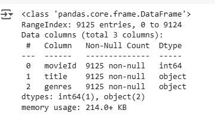 
Gambar 1. Informasi data variabel movie 

**B. rating.csv **
- `userId` memiliki sejumlah Non-Null sebanyak 100004 entries dan type data ``int``.
- `movieId` memiliki sejumlah Non-Null sebanyak 100004 entries dan typedata ``int``.
- `timpestamp` memiliki sejumlah Non-Null sebanyak 100004 entries dan typedata `int`. 
berikut gambar hasil informasi variabel rating 
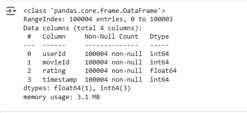 
Gambar 2. Informasi data variabel rating 

**C. tag.csv **
- `userId` memiliki sejumlah Non-Null sebanyak 1296 entries dan type data ``int``.
- `movieId` memiliki sejumlah Non-Null sebanyak 1296 entries dan type data ``int``.
- `tag` memiliki sejumlah Non-Null sebanyak 1296 entries dan type data ``object``.
- `timestamp` memiliki sejumlah Non-Null sebanyak 1296 entries dan type data `int`. 
berikut gambar hasil informasi variabel tag 
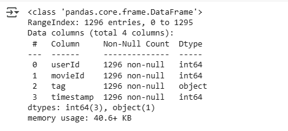 
Gambar 3. Informasi data variabel tag 

**D. link.csv **
- `movieId` memiliki sejumlah Non-Null sebanyak 9125 entries dan type data `int`.
- `imdbId` memiliki sejumlah Non-Null sebanyak 9125 entries dan type data `int`.
- `tmdbId` memiliki sejumlah Non-Null sebanyak 9125 entries dan type data `float` 
berikut gambar hasil informasi variabel link 
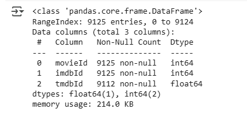 
Gambar 4. Informasi data variabel link 

#### 4. Ringkasan statistik data
**A. movie.csv **
Beberapa insight pada variabel `movie`, diantaranya : 
- Jumlah data yang dimiliki pada variabel `movie` ialah 9125 data, rata-rata data ialah 31123 data, standar deviasi ialah 40782 data.
- dari yang penulis ketahui dari kolom `title` bahwa judul film yang sering muncul 2 kali ialah `Halmet (2000)` dan dari kolom `genre` yang banyak diminati pengguna ialah `drama`. 
berikut gambar hasil dari data statistik variabel movie 
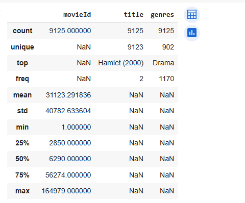 
Gambar 5. Data statistik variabel movie 

**B. rating.csv **
beberapa insight pada variabel `rating` diantaranya : 
- Dataset berisi 100.004 rating dari berbagai user dan film, dengan distribusi waktu yang panjang (1990-an sampai 2016).
- Rating cenderung tinggi, menunjukkan potensi bias positif dari pengguna.
- pada variabel `rating` kolom `movieId` mengalami duplikat data yang akan di bersihkan pada tahap selanjutnya. 
berikut gambar hasil dari data statistik variabel rating 
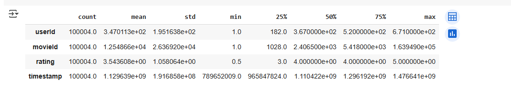 
Gambar 6. Data statistik variabel rating 

**C. tag.csv **
beberapa insight pada variabel `tag` diantaranya : 
- dataset pada variabel `tag` memiliki data sebanyak 1296 entries dari pengguna dan film.
- interaksi yang didapat bahwa film didominasi oleh film-film dengan userId yang relatif rendah dengan sejumlah kecil interaksi terjadi pada film-film dengan userId yang sangat tinggi.
- mayoritas interaksi didominasi dengan rentang waktu dari pertengahan tahun 2012 sampai tahun 2016. 
berikut gambar hasil data statistik variabel tag 
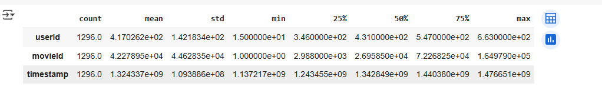 
Gambar 7. Data statistik variabel tag 

**D. link.csv **
beberapa insight yang didapat dari variabel `link` diantaranya : 
- terdapat rentang nilai yang sangat lebar, ditunjukkan perbedaan besar antara nilai `min` dan `max` serta `std` yang signifikan. Hal ini mengindikasikan bahwa dataset mencakup film-film dengan ID yang beragam dalam masing-masing sistem. 
berikut gambar hasil data statistik varaibel link 
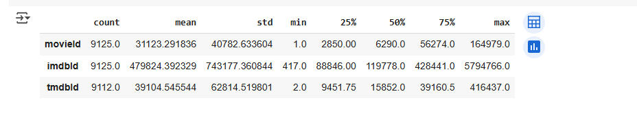 
Gambar 8. Data statistik variabel link 

#### 5. Informasi kondisi data
**A. Variabel movie **
- Pada variabel movie tidak memiliki missing value dan semua data pada `movie` memiliki **data bersih. **
  
**B. Variabel rating **
- semua data dalam variabel `rating` tidak memiliki missing value dan user yang memberikan rating pada film cenderung tidak berstruktur dimana adanya user memberikan rating 1 sampai 4 pada film. 

**C. Variabel tag **
- semua data pada variabel `tag` tidak memiliki memiliki missing value. 

**D. Variabel link **
- pada semua data dalam variabel `link` tidak memiliki missing value. 

#### 6. Cek duplikat data
Pada tahap ini, penulis perlu untuk mengecek apakah setiap variabel memiliki data duplikat, dari pengujian yang penulis lakukan, bahwa **semua variabel tidak memiliki duplikat data **.

### Exploratory Data Analysis (EDA)
**Distribusi Rating **
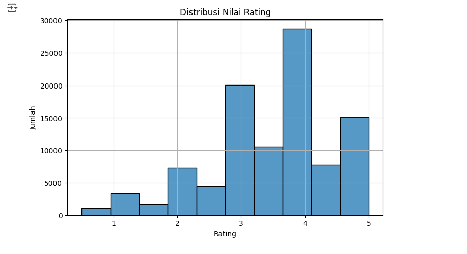 
Gambar 9. Distribusi Visualisasi Rating 
Pada hasil Visualisasi yang didapat bahwa distribusi condong kekanan (positif), mayoritas pengguna memberikan rating 3-5, tetapi rating terbanyak ialah rating 4 sebanyak 30.000 rating sedangkan rating 1 dan 2 memiliki jumlah yang sangat kecil dimana sedikit pengguna yang tidak menyukai film. 

**Distribusi Genre **
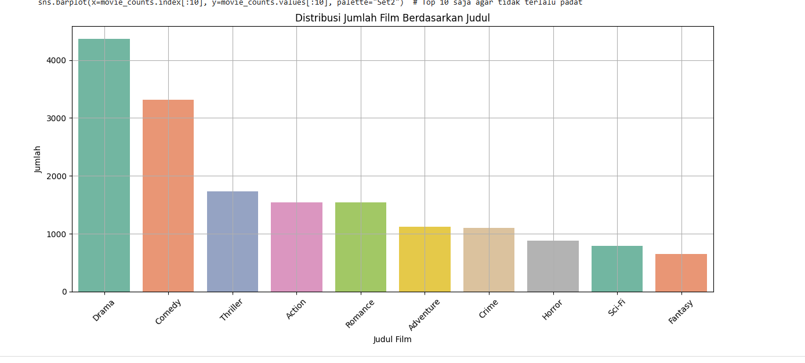 
Gambar 10. Distribusi Visualisasi Genre 
Pada hasil visualisasi yang diketahui bahwa genre drama yang paling banyak mencapai 4000 film diikuti oleh genre Comedy sebanyak 3000 film. sedangkan genre yang paling sedikit diminati ialah Horror, Sci-Fi,dan Fantasy sebanyak 1000 film. 

**Distribusi Film Terbaik **
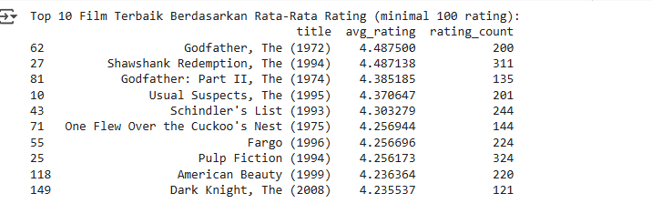 
Gambar 11. Visualisasi list film terbaik. 
Pada hasil visualisasi yang didapat bahwa  ``film GodFather, The (1972)`` ialah film **terbaik dengan rating 4.487** yang diberikan pengguna dibanding dengan film yang lainnya. seperti **film Dark Knight, The (2008)** memiliki rating terendah sebanyak 4,23. setelah mendapatkan hasilnya berupa list. maka penulis menampilkan visualisasi film terbaik berdasarkan bar char, berikut hasil visualisasinya. 
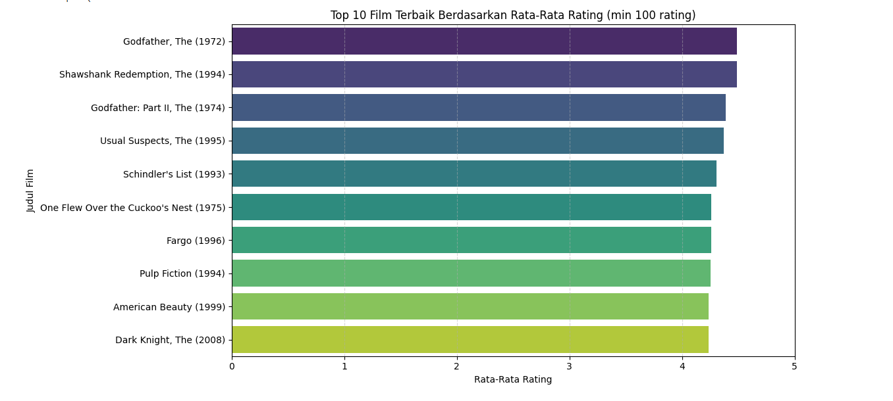 
Gambar 12. Visualisasi film terbaik. 

### Data Processing 
Pada tahap ini, penulis melakukan Processing dari semua dataset yang telah penulis lakukan sebelumnya di data understanding, sekarang penulis perlu untuk melakukan penggabungan dataset yang akan dianalisis lebih lanjut ke model yang akan penulis latih. langkah - langkah yang dilakukan penulis ialah : 
- menggabungkan semua data movieId
- menggabungkan semua data userId
- menyimpan ke dataframe baru.

**Menggabungkan semua data movieId **
  Pada tahap ini, penulis melakukan penggabungan data terhadap data unik `movieId` dari semua variabel-varibel yang memiliki hubungan satu sama lain, setelah melakukan penggabungan data unik, penulis menampilkan banyak jumlah data unik `movieId`. berikut jumlah data unik `movieId` 
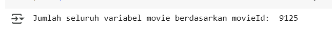 
Gambar 13. Hasil jumlah data `movieId`. 

**Menggabungkan semua data userId **
Pada tahap ini, penulis melakukan penggabungan data terhadap data unik `userId` dari semua variabel-variabel yang memiliki hubungan satu sama lain, setelah melakukan penggabungan data unik, penulis menampilkan hasil jumlah dari penggabungan yang penulis buat, berikut hasilnya 
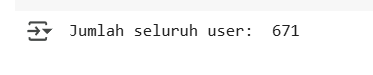 
Gambar 14. Hasil jumlah data `userId` 

**Menyimpan ke dataframe baru **
setelah melakukan penggabungan data unik sebelumnya, maka penulis perlu untuk menyimpan semua penggabungan data unik kedalam dataframe baru yaitu `all_movie_name`, seperti gambar berikut 
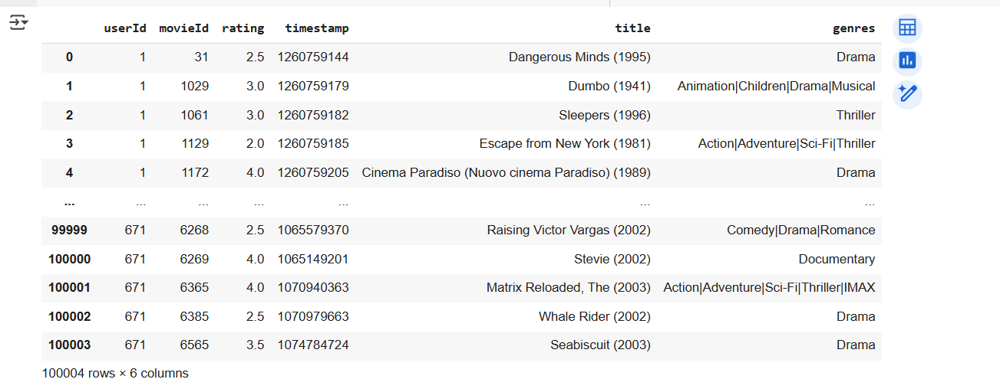 
Gambar 15. penggabungan kedua variabel  

## Data Preparation
Pada bagian ini Anda menerapkan dan menyebutkan teknik data preparation yang dilakukan. Teknik yang digunakan pada notebook dan laporan harus berurutan.

**Rubrik/Kriteria Tambahan (Opsional)**: 
- Menjelaskan proses data preparation yang dilakukan
- Menjelaskan alasan mengapa diperlukan tahapan data preparation tersebut.

## Modeling
Tahapan ini membahas mengenai model sisten rekomendasi yang Anda buat untuk menyelesaikan permasalahan. Sajikan top-N recommendation sebagai output.

**Rubrik/Kriteria Tambahan (Opsional)**: 
- Menyajikan dua solusi rekomendasi dengan algoritma yang berbeda.
- Menjelaskan kelebihan dan kekurangan dari solusi/pendekatan yang dipilih.

## Evaluation
Pada bagian ini Anda perlu menyebutkan metrik evaluasi yang digunakan. Kemudian, jelaskan hasil proyek berdasarkan metrik evaluasi tersebut.

Ingatlah, metrik evaluasi yang digunakan harus sesuai dengan konteks data, problem statement, dan solusi yang diinginkan.

**Rubrik/Kriteria Tambahan (Opsional)**: 
- Menjelaskan formula metrik dan bagaimana metrik tersebut bekerja.

**---Ini adalah bagian akhir laporan---**

_Catatan:_
- _Anda dapat menambahkan gambar, kode, atau tabel ke dalam laporan jika diperlukan. Temukan caranya pada contoh dokumen markdown di situs editor [Dillinger](https://dillinger.io/), [Github Guides: Mastering markdown](https://guides.github.com/features/mastering-markdown/), atau sumber lain di internet. Semangat!_
- Jika terdapat penjelasan yang harus menyertakan code snippet, tuliskan dengan sewajarnya. Tidak perlu menuliskan keseluruhan kode project, cukup bagian yang ingin dijelaskan saja.
